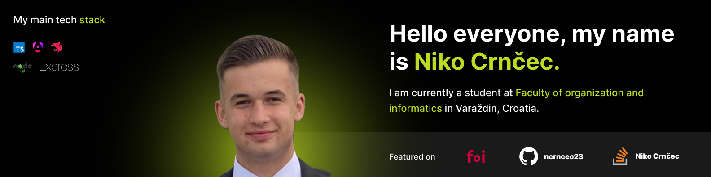

###



###

<h1 align="left">👋 Hi, my name is Niko Crnčec, IT student @ FOI Varaždin</h1>

<p align="left">
  Passionate primarily backend-focused software developer working on modern web applications using technologies such as Node.js, Express, TypeScript, Angular, and NestJS. I am especially interested in backend and data-driven solutions with Python, Flask, PostgreSQL, and Power BI, as well as desktop application development in C# using WinForms, LINQ, and Entity Framework. Currently exploring advanced concepts in web development and Node.js, with a strong interest in future mobile development using Flutter (Dart) and Kotlin.
</p>

###

<p align="center"></p>

###

<h3><strong>More interesting facts about me</strong> 🙋‍♂️</h3>

<ul>
  <li>I study <a href="https://www.foi.unizg.hr/hr/studiji/itdp">Information Technologies and Business Digitalization</a>, specialization <strong>Application Development 🧑‍💻</strong>, at <a href="https://www.foi.unizg.hr/">FOI</a>🔴 in Varaždin.</li>
  <li>I love sports like basketball, football and handball. 🏀</li>
  <li>Besides sport I enjoy e-sports and videogames like Rocket League, League of legends and CS2. 🎮</li>
  <li>I enjoy drinking beer 🍺 and playing darts 🎯 in my free time – it helps me relax after coding sessions.</li>
</ul>

###

<h1 align="left">💡 GITHUB STATS 📚</h1>

###


###

<h1 align="left">💻 TECH STACK 🧑‍💻</h1>

###

<div align="left">
  
  
  
  
  
  
  
  
  
  
  
  
  
  
  
  
  
  
  
  
  
  
  
  
  
  
  
  
  
  
  
  
  
  
  
  
  
  
  
  
  
  
  
  
  
  
  
  
  
  
  
  
  
  
  
  
  
  
  
  
  
  
  
  
  
  
  
</div>

###

<h3><strong>📽️ My top projects 🎓</strong><h3>

###

```json
{
  "name": "Niko Crnčec",
  "role": "Fullstack Web developer / IT student",
  "years": 21,
  "date-of-birth": "18.02.2005",
  "my-top-projects": [
    {
      "name": "Astera",
      "description": "Web application for IT project managment",
      "technologies": ["Node.js", "Typescript", "Angular", "JWT", "SQLite"],
      "information": "This project is still under development"
    },
    {
      "name": "Facial recognition application",
      "description": "Python application for face recognition using deep learning models",
      "technologies": ["Python", "Tensorflow", "Jupyter Notebook"],
      "information": "This project is done and ready for use, detailed description is in projects README.md"
    },
    {
      "name": "Task managment application",
      "description": "Flask web application for managing tasks",
      "technologies": ["Python", "Flask", "JavaScript", "SQLite"],
      "information": "This project is done and ready for use, detailed description is in projects README.md"
    },
    {
      "name": "CloudMate",
      "description": "Web weather application using OpenWeatherMap API.",
      "technologies": ["JavaScript", "HTML", "CSS", "REST API"],
      "information": "This project is done and ready for use, detailed description is in projects README.md"
    },
    {
      "name": "FinSync",
      "description": "Personal finance tracking desktop application",
      "technologies": ["C#", "LINQ", "Entity Framework", "Windows Forms"],
      "information": "This project is done but it is a private repository."
    }
  ]
}
```

###

<picture>
  <source media="(prefers-color-scheme: dark)" srcset="https://raw.githubusercontent.com/ncrncec23/ncrncec23/output/github-snake-dark.svg" />
  <source media="(prefers-color-scheme: light)" srcset="https://raw.githubusercontent.com/ncrncec23/ncrncec23/output/github-snake.svg" />
  
</picture>

###

<h1 align="left">💬 SOCIAL MEDIA 📢</h1>

<ul>
  <li>💼 <a href="https://www.linkedin.com/in/nikocrncec/">LinkedIn</a> - check out my LinkedIn profile</li>
  <li>👍 <a href="https://www.facebook.com/niko.crncec/">Facebook</a> - check out my Facebook profile</li>
  <li>📸 <a href="https://www.instagram.com/niko_crncec/">Instagram</a> - check out my Instagram profile</li>
  <li>💻 <a href="https://stackoverflow.com/users/31724200/niko-crn%c4%8dec">StackOverflow</a> - check out my StackOverflow profile</li>
</ul>

###
